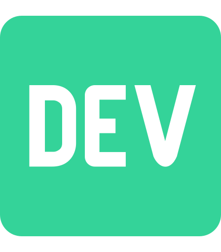

<h1 align="center" style="font-weight: bold;">Hi 👋, I'm Mihawx</h1>

<h3>A passionate full-stack developer from Morocco</h3>

- 🌱 I’m currently learning **Elixir, (more) Rust**

- 👨‍💻 All of my projects are available in my [portfolio](mihawx.github.io)

- 💬 Ask me about **Python, Svelte, Tailwind**

- 📫 How to reach me: **mihawx@outlook.com**

<h3>Connect with me:</h3>

